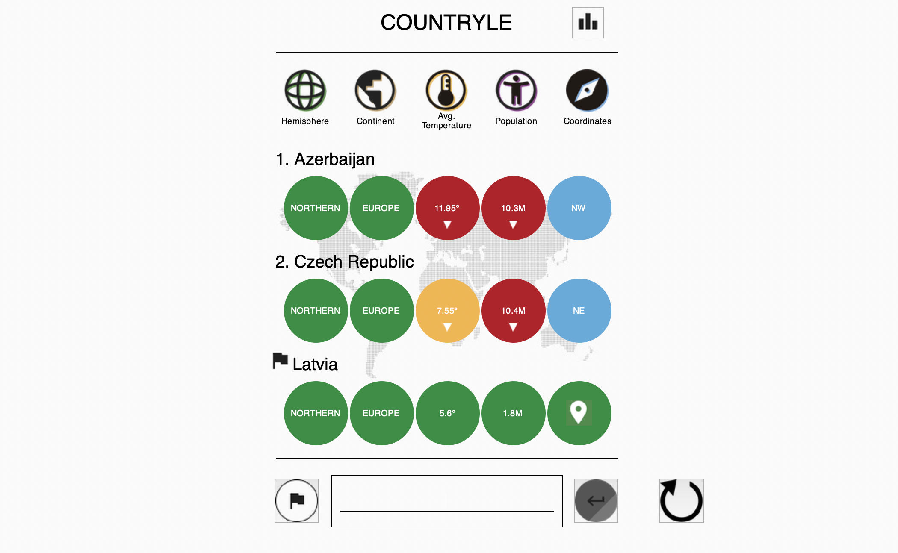
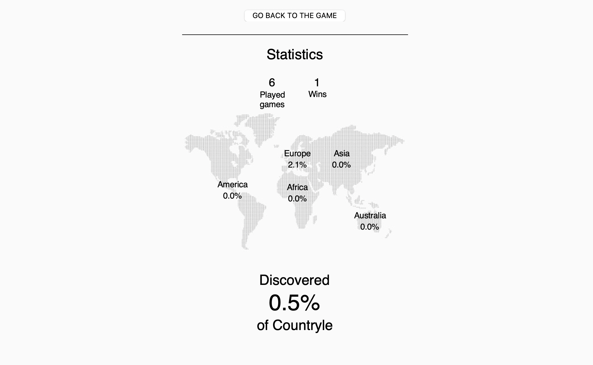

# Countryle

Countryle is a country guessing game implemented in Python. The game randomly selects a country, and the player has to guess the correct country within a limited number of attempts.

## Features

- Guess the country within 6 attempts.
- View information about each country, such as continent, population, temperature, and location.
- Results are saved in a JSON file, including the number of games played, wins, and discovered countries.

## Project Structure

The project is organized into the following files and folders:

- `logic.py`: Contains the game logic implementation.
- `main.py`: Implements the graphical user interface using Tkinter.
- `Data/`: Contains the following JSON files.
  - **Information.json:** Stores details about each country, such as continent, population, temperature, and coordinates.
  - **Results.json:** Tracks game statistics, including the number of games played, wins, and discovered countries.

- `Img/`: Folder with images used in the game.

## Dependencies

- Python 3.x
- Tkinter (usually included with Python installations)
- Pillow (PIL) library for image processing

### Installing Pillow on Linux

If you encounter issues with the Pillow library, follow these steps to install or update it on Linux devices:

#### Install Pillow:

```bash
sudo apt-get install python3-pil python3-pil.imagetk
```

This command installs both the python3-pil and python3-pil.imagetk packages, which are necessary for image processing and Tkinter support.

#### Update Pillow:

If you have an older version of Pillow and need to update it, use the following command:

```bash
python3 -m pip install --upgrade pillow
```

This command updates Pillow to the latest version, ensuring compatibility with the Countryle game.

Make sure to run these commands in your terminal before starting the game to ensure the correct installation and compatibility with the required Pillow version.

## How to Run

 #### 1. Clone the repository:
  ```bash
  git clone https://github.com/your-username/countryle.git
  ```
 #### 2. Navigate to the project directory:
  ```bash
  cd countryle
  ```
 #### 3. Run the game:
  ```bash
  python3 main.py
  ```

  ## Gameplay

1. **Enter the name of the country in the input box.**
2. **Submit your guess using the "Submit" button or by pressing the "Enter" key.**
3. **The game provides feedback on each guess, such as hemisphere, continent, temperature, population, and location.**
4. **Continue making guesses until you find the correct country or exhaust the allowed attempts.**
5. **If you haven't guessed the correct country in 6 attempts, the game will automatically reveal the correct country.**
6. **View game statistics and results in the "Results" section.**

## Screenshots

### Main Gameplay Screen



### Results Screen



## Results and Statistics

- **The game keeps track of the total number of games played, wins, and the percentage of discovered countries.**
- **Statistics are displayed in the results page accessed through the "Results" button.**

## License

This project is licensed under the [MIT License](LICENSE).

See the [LICENSE](LICENSE) file for details.
